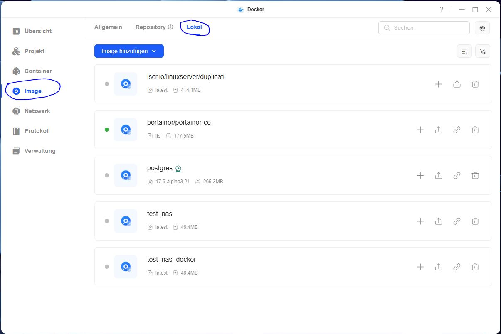
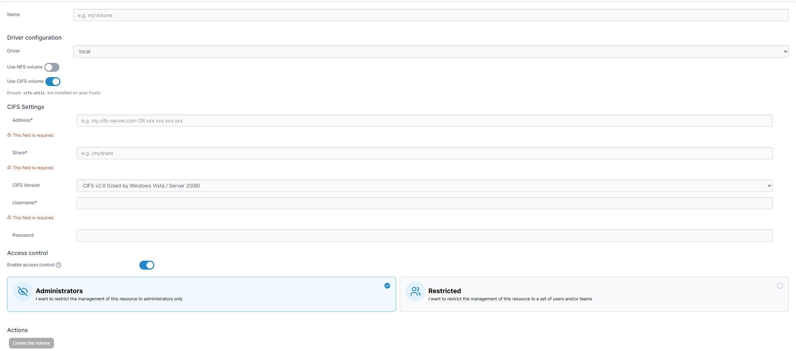
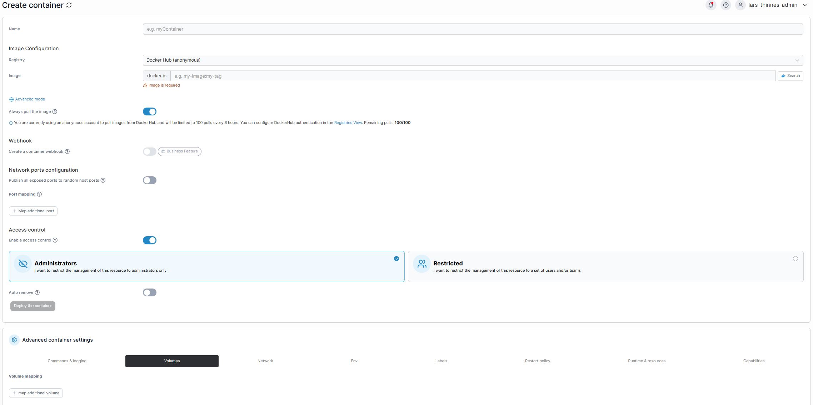

In dieser Schritt fuer Schritt Anleitung wird beschrieben, wie dieses Skript auf einem Ugreen_Nas zu starten ist:

Skript in zum Ugreen Docker bringen
- Die .tar Datei aus diesem Repository auf dem Nas speichern
- In der Ugreen Docker Anwendung auf Image und dann auf Lokal wechseln:

- Im Menue Image hinzufuegen die Option: "von NAS" waehlen und im Explorer die .tar Datei suchen.

Portainer installieren
- Im NAS unter Systemeinstellungen den Punkt Terminal oeffnen
- In diesem Punkt die SSH Verbindung aktivieren, dabei passen die Einstellungen
- Nun ueber ein Terminal mit dem Ugreen NAS verbinden durch
    - ssh *Admin_Account_Name*@*IP_Adresse des NAS*
- Bei der Frage nach einem Fingerprint akzeptieren 
- Admin Passwort eingeben
    - Das Passwort wird nicht im Terminal angezeigt
- Ein Volumen fuer Portainer erstellen:
    - sudo docker volume create *name_des_wunsch_volumnes*
    - Mit Passwort bestaetigen
- Portainer installieren:
    - sudo docker run -d -p *Wunsch_Port*:9443 --name *Wunsch_Conatiner_Name* --restart *Wunsch_Einstellung* -v /var/run/docker.sock:/var/run/docker.sock -v *Den Namen des eben erstellten Volumens*:/data portainer-ce:lts

Portainer oeffnen
- Ueber die IP_Adresse mit dem *Wunsch_Port* auf Portainer Verbinden.
- Bei einen Admin Account erstellen.
- Mit dem *Get Startet* Knopf mit dem NAS verbinden.
- Das NAS dann als Environment auswaehlen.
- In Portainer fuer das NAS drei neue Volumen erstellen

    1. Das Verzeichnis auf dem die ersten Bilder liegen, meist:
        - Name: *Person1_Volumen*
        - Use CIFS
        - Adresse: *IP_Adresse des NAS*
        - Share: */personal_folder/Weiterer_Pfad_zu_den_Bildern*
        - Username: *User Name der Person1*
        - Password: *Passwort der Person1*
    2. Das Verzeichnis auf dem die zweiten Bilder liegen, meist:
        - Name: *Person2_Volumen*
        - Use CIFS
        - Adresse: *IP_Adresse des NAS*
        - Share: */personal_folder/Weiterer_Pfad_zu_den_Bildern*
        - Username: *User Name der Person2*
        - Password: *Passwort der Person2*
    3. Das Zielverzeichnis
        - Name: *Ziel_Volumen*
        - Use CIFS
        - Adresse: *IP_Adresse des NAS*
        - Share: */Weiterer_Pfad_zu_den_Bildern*
        - Username: *Admin User kann verwendet werden*
        - Password: *Admin User kann verwendet werden*
- Container Starten

    - Auf dem Tab Container einen neuen erstellen
    - Name: *Wunsch Name vergeben*
    - Image: *Name des Images suchen, wie es in der Docker App steht*
    - Bei Volumen, 3 Volumen erstellen
        1. /app/skripts/image_folders/images_source_1 -> *Person1_Volumen*
        2. /app/skripts/image_folders/images_source_2 -> *Person2_Volumen*
        3. /app/skripts/image_folders/images_target -> *Ziel_Volumen*
    - Bei Restart Policy: Always
    - Container Deployen
